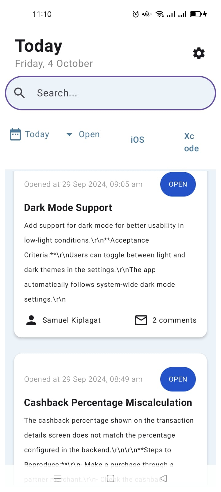
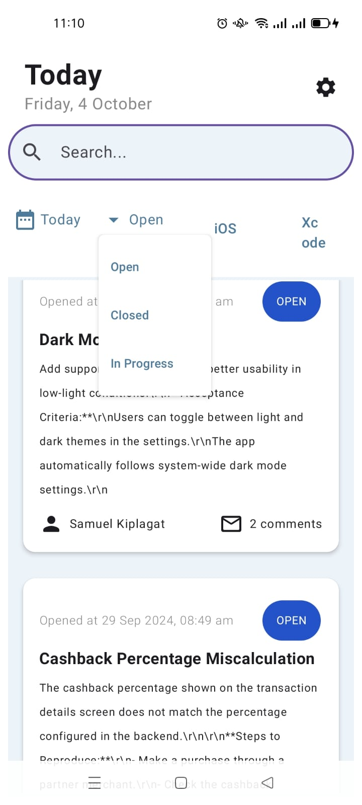

### GitIssueTracker

#### Introduction
Building a GITHUB ISSUE TRACKER mobile app using Kotlin and Jetpack Compose.

---

### How it's built

#### Technologies used
* [Kotlin](https://kotlinlang.org/)
* [Jetpack Compose](https://developer.android.com/jetpack/compose)
* [Jetpack Compose Material 3](https://developer.android.com/jetpack/androidx/releases/compose-material3)
* [Coroutines](https://kotlinlang.org/docs/reference/coroutines-overview.html)
* [Flow](https://kotlinlang.org/docs/reference/coroutines/flow.html)
* [KOIN Dependency](https://insert-koin.io/)
* [GraphQL](https://graphql.org/)
* [Retrofit](https://square.github.io/retrofit/)
  * [Jetpack](https://developer.android.com/jetpack)
    * [Lifecycle](https://developer.android.com/topic/libraries/architecture/lifecycle)
    * [ViewModel](https://developer.android.com/topic/libraries/architecture/viewmodel)
* [Timber](https://github.com/JakeWharton/timber)

#### Architecture
* MVVM - Model View ViewModel

#### Tests
* [JUnit5](https://junit.org/junit5/)
* [MockK](https://github.com/mockk/mockk)

#### Gradle
* [Gradle Kotlin DSL](https://docs.gradle.org/current/userguide/kotlin_dsl.html)

#### CI/CD
* GitHub Actions

---

### Screenshots

Include screenshots of your app here to showcase the UI and functionality. This will help users understand the design and experience of your application.

### Screenshots

  
  

---

### Conclusion
This mobile app aims to provide a seamless experience for tracking GitHub issues, utilizing modern Android development practices and libraries.

For contributions or inquiries, feel free to reach out!
